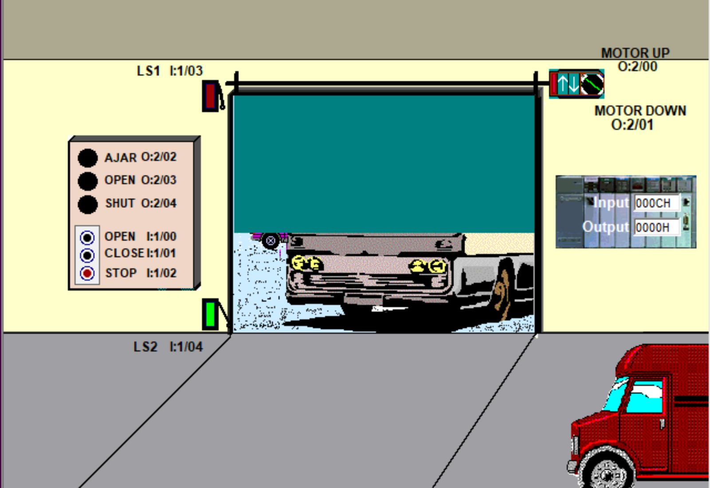

# Garage Door Overview   

**Simulation:** LogixPro Door Simulator  
**Platform:** RSLogix 500 (Emulator by TLP)
**Author:** Sam M.
**Source:** [TLP Door Exercises](https://thelearningpit.com/lp/doc/dl/dl-rl.html)

## System Overview
2 Motors that move door up and down, 2 Limit Switches, operator panel with Open, Close and Stop PBs and (3) pilot lamps. 

## Assumptions & Clarifications
- Inputs are momentary pushbuttons and limit switches and outputs are motor coils and pilot lamps.
- Stop de-energizes both motors.
- When the door is in the fully open position, LS1 and LS2 do not have closed contacts. Both are Normally Open.
- Motor windings should never run at the same time as each other. 
- Limit Switches are to be used to sense and log the state of the door system.

## I/O Map (Master)
| Symbol          | Address | Type | Normal |       Description                        |
| --------------- | ------- | ---- | ------ |  --------------------------------------- |
| `Open`          | I:1/0   | DI   | Open   | Motor 1 (up windings) Start pushbutton   | 
| `Close`         | I:1/1   | DI   | Open   | Motor 2 (down windings) Start pushbutton |
| `Stop`          | I:1/2   | DI   | Closed | Stop pushbutton                          |
| `LS1`           | I:1/3   | DI   | Open   | Upper Limit Switch                       |
| `LS2`           | I:1/4   | DI   | Open   | Lower Limit Switch                       |
| `Motor Up`      | O:2/0   | DO   | –      | Motor 1 (up windings) output coil        |
| `Motor Down`    | O:2/1   | DO   | –      | Motor 2 (down windings) output coil      |
| `Ajar Lamp`     | O:2/2   | DO   | –      | Ajar Lamp output coil                    |
| `Open Lamp`     | O:2/3   | DO   | –      | Open Lamp output coil                    |
| `Shut Lamp`     | O:2/4   | DO   | –      | Shut Lamp output coil                    |

