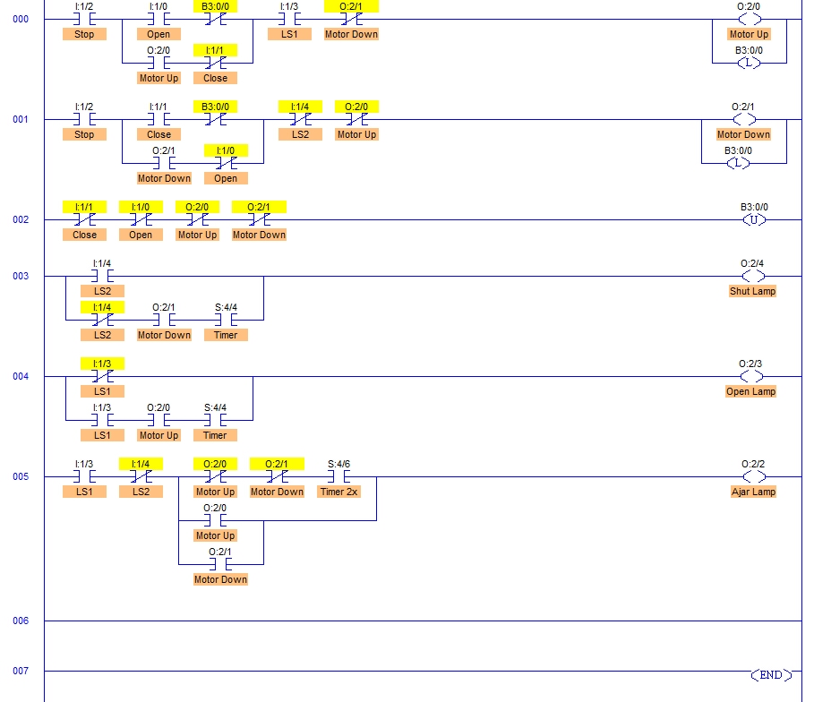

# Garage Door Ex03–Ex04

- **Simulation:** Door ex03 & ex04
- **Platform:** RSLogix 500
- **Author:** Sam M.
- **Source:** TLP Door Exercises

---

## Problem Statement *(copied verbatim)*

> **Student Programming Exercise #3:**
> In this exercise we want to introduce you to a simple programming technique for adding a bit of "Flash" to your program. We want you to make use of the PLC's Free Running Timer which can be viewed in the Data Table Display at location S2:4. This integer word contains a count which is incremented continuously by the PLC when it is in the Run mode, and it can come in quite handy at times for variety of purposes. In this exercise we want you to utilize this word as follows:
>
> With the PLC in the Run mode, Display word S2:4 utilizing the Data Table display. Ensure that the Radix is set to Binary so that you can view the individual bits within the word. You should see a binary count in progress where the rate of change of each bit is directly related to it's position within the word. Bit 0 will have the highest rate, while Bit 1 will be 1/2 as fast as Bit 0, and Bit 2 half as fast as 1 etc. etc.
>
> We want you to add a Lamp Flasher to your program by monitoring the state of one of these bits with an XIC instruction. I'm going to suggest using Bit 4 for this purpose, but depending upon the speed of your computer you may elect to substitute another Bit. With an actual AB PLC, the rate is consistent, but with LogixPro it varies from computer to computer.
>
> Place an XIC instruction addressed to S:4/4 on the rung which controls either the Open or Shut Lamp in your previous program. Now download and Run this modified program to see the flashing effect achieved. The Lamp should flash at a reasonable rate whenever your program energizes the selected Lamp.
>
> Now modify your program so that the following criteria is met:
>
> If the Door is fully open, the Open lamp will be energized but not flashing as was the case before.
>
> If the Door is opening, the Open lamp will flash while the door is in motion.
>
> If the Door is fully closed, the Shut lamp will be energized but not flashing as was the case before.
>
> If the Door is closing, the Shut lamp will flash while the door is in motion.
>
> The Ajar Lamp will flash if the door is stationary, and is not in the fully open or fully closed position. The Ajar Lamp will flash at a slower rate (1/4) then the other lamps.
>
> The Ajar Lamp will be illuminated in a steady state if the door is in motion.
>
> As before, ensure that you have made effective use of both instruction and rung comments to clearly document your program.

> **Student Programming Exercise #4:**
> In this exercise we want you to add one final touch which will possibly extend the life of the door hardware. Starting and stopping the door motion obviously puts a strain on the door hardware, but reversing the direction of the door without giving it a chance to fully stop causes an even greater strain. We want you to modify your program to prevent the possibility of immediate reversal. As we don't need much of a delay, the following additional criteria should suffice:
>
> If the door is currently opening, pressing the Close Switch will immediately halt movement. Door movement will remain halted when the switch is released.
>
> If the door is currently closing, pressing the Open Switch will immediately halt movement. Door movement will remain halted when the switch is released.
>
> Once movement is halted, and all push buttons have been released, then door motion in either direction can once again be initiated by pressing the appropriate Open or Close button.
>
> The utilization of Binary or Integer Table bits to Flag specific conditions within your program would be appropriate. Also, the retentive OTL and OTU instructions may be utilized freely at your discretion.
>
> Hint: If you review the foregoing criteria carefully, you should note the the motor should only be permitted to start after a specific set of conditions have been met. The conditions being that the motor is stopped, and all switches are released.. Since this same set of conditions will apply to both the door opening, and door closing operations, this may be the ideal time to use flagging.... By flagging, I mean that you will use a bit in the PLC memory (such as B3:0/0) to indicate that a specific condition, or set of conditions exist.
>
> Example: You might add a new rung to the beginning of your program, and insert instructions to test that the motor is stopped, and all switches are released... Latch bit B3:0/0 True (ON) if so, and name it something like "Ready-To-Start".... Now you can add an XIC instruction addressed to this "Ready-To-Start" bit to both your existing Motor UP, and Motor Down control rungs, and this will confirm that the motor may be started.. Of course you will need to unlatch the "Ready-To-Start bit once the motor is started.
>
> BTW: Almost any unused bit may be used as a flag, but since has set aside the B3: memory area, and this memory area displays in binary format by default, it's commonly used for this purpose.. N7:1/12 would work however, but the N7 area is normally used as place for storing integers as this memory area is displayed in decimal by default... Additionally, it is sometimes possible to use an Operator Panel lamp as flag if the conditions suit.

---

## I/O Map (Master)

| Symbol         | Address | Type | Normal     | Description                                  |
| -------------- | ------- | ---- | ---------- | -------------------------------------------- |
| `Open`         | I:1/0   | DI   | Open       | Open (Up) PB                                 |
| `Close`        | I:1/1   | DI   | Open       | Close (Down) PB                              |
| `Stop`         | I:1/2   | DI   | **Closed** | NC Stop PB (opens when pressed)              |
| `LS1`          | I:1/3   | DI   | Open       | Upper limit (Fully **OPEN**)                 |
| `LS2`          | I:1/4   | DI   | Open       | Lower limit (Fully **SHUT**)                 |
| `Motor Up`     | O:2/0   | DO   | –          | Up windings                                  |
| `Motor Down`   | O:2/1   | DO   | –          | Down windings                                |
| `Ajar Lamp`    | O:2/2   | DO   | –          | Ajar indicator                               |
| `Open Lamp`    | O:2/3   | DO   | –          | Fully open indicator                         |
| `Shut Lamp`    | O:2/4   | DO   | –          | Fully closed indicator                       |
| `Blink`        | S:4/4   | SF   | –          | Free-running bit (flash rate for Open/Shut)  |
| `Blink 2×`     | S:4/6   | SF   | –          | Slower blink (¼ rate for Ajar stationary)    |
| `ReadyToStart` | B3:0/0  | MB   | –          | Flag: motor stopped **and** all PBs released |

*SF = Status file bit; MB = internal memory bit.*

---

## Ladder Logic (reference)

```markdown

```

---

## Sequence of Operations

1. **Ready to Start (Ex04):**

   * When **both motors are OFF** and **Open, Close, Stop are released**, `ReadyToStart (B3:0/0)` is **latched ON**.
   * As soon as either motor output turns ON, `ReadyToStart` is **unlatched**.
   * Both the **Open** and **Close** motor rungs require `ReadyToStart=1` to start a move.

2. **Start OPENING (maintained to completion as in Ex02):**

   * Preconditions: `ReadyToStart=1`, not fully open (`LS1` not made).
   * Press **Open** → `Motor Up` energizes and **seals-in** until `LS1` makes or **Stop** is pressed.
   * If **Close** is pressed while opening (Ex04 rule), movement **halts immediately** and remains halted after release (no reversal until idle & `ReadyToStart` returns true).

3. **Start CLOSING (maintained to completion):**

   * Preconditions: `ReadyToStart=1`, not fully closed (`LS2` not made).
   * Press **Close** → `Motor Down` energizes and **seals-in** until `LS2` makes or **Stop** is pressed.
   * If **Open** is pressed while closing, movement stops and remains halted (no reversal until idle & `ReadyToStart` returns true).

4. **Stop behavior:**

   * Pressing **Stop** de-energizes the running motor and holds the door **halted** (seal-in drops). New command allowed after PBs are released and `ReadyToStart` sets.

5. **Mutual exclusion:**

   * Each direction rung includes an **interlock** for the opposite motor output so **both windings are never ON simultaneously**.

6. **Lamp behavior (Ex03):**

   * **Open Lamp**:

     * **Steady ON** when `LS1` made (fully open).
     * **Flashing** (gated by `S:4/4`) while **OPENING** and not yet at `LS1`.
   * **Shut Lamp**:

     * **Steady ON** when `LS2` made (fully closed).
     * **Flashing** (gated by `S:4/4`) while **CLOSING** and not yet at `LS2`.
   * **Ajar Lamp**:

     * Door **between limits** + **stationary** → **flash slowly** using `S:4/6`.
     * Door **between limits** + **moving** → **steady ON**.

---

## State Model

| State            | Entry Condition (sensed)                                                                            | Transition (event)                                                                                             | Outputs while in State                                                             |
| ---------------- | --------------------------------------------------------------------------------------------------- | -------------------------------------------------------------------------------------------------------------- | ---------------------------------------------------------------------------------- |
| **CLOSED**       | `LS2` made; `LS1` clear                                                                             | **Open PB** (with `ReadyToStart=1`) → **OPENING**                                                              | Motors OFF; **Shut Lamp steady ON**; Open/Ajar OFF                                 |
| **OPENING**      | Between limits; `Motor Up=ON` (seal-in)                                                             | **LS1 makes** → **OPEN**; **Stop PB** → **AJAR/STOPPED**; **Close PB** → **AJAR/STOPPED** (Ex04 anti-reverse)  | `Motor Up ON`; **Open Lamp flashing** via `S:4/4`; Shut OFF; Ajar **steady OFF**   |
| **OPEN**         | `LS1` made; `LS2` clear                                                                             | **Close PB** (with `ReadyToStart=1`) → **CLOSING**                                                             | Motors OFF; **Open Lamp steady ON**; Shut/Ajar OFF                                 |
| **CLOSING**      | Between limits; `Motor Down=ON` (seal-in)                                                           | **LS2 makes** → **CLOSED**; **Stop PB** → **AJAR/STOPPED**; **Open PB** → **AJAR/STOPPED** (Ex04 anti-reverse) | `Motor Down ON`; **Shut Lamp flashing** via `S:4/4`; Open OFF; Ajar **steady OFF** |
| **AJAR/STOPPED** | Between limits; both motors OFF (after Stop or anti-reverse); PBs released → `ReadyToStart` may set | **Open PB** + `ReadyToStart=1` → **OPENING**; **Close PB** + `ReadyToStart=1` → **CLOSING**                    | Motors OFF; **Ajar Lamp flashing slowly** via `S:4/6`                              |

*Note:* While **AJAR/STOPPED** and either motor is commanded (and `ReadyToStart=1`), the Ajar Lamp changes to **steady ON** during motion, per spec.

---

## Validation

1. **Open lamp flash/steady:**

   * From **CLOSED**, press **Open** and release immediately.
   * Verify: `Motor Up` continues; **Open Lamp flashes** while moving; at `LS1` the motor stops and **Open Lamp becomes steady**.
2. **Shut lamp flash/steady:**

   * From **OPEN**, press **Close** and release.
   * Verify: `Motor Down` continues; **Shut Lamp flashes** while moving; at `LS2` the motor stops and **Shut Lamp becomes steady**.
3. **Ajar slow-flash vs. steady:**

   * Stop the door mid-travel (**AJAR/STOPPED**). Verify **Ajar Lamp flashes slowly** (gated by `S:4/6`).
   * Command movement from mid-travel; while the door is moving, **Ajar Lamp turns steady ON**.
4. **Anti-reversal (Ex04):**

   * While **OPENING**, press **Close** → movement halts **immediately**; release **Close** → door remains halted.
   * While **CLOSING**, press **Open** → same behavior (halt and remain halted).
5. **Ready-to-Start gate:**

   * After an anti-reverse halt, release **all PBs** and ensure both motors are OFF.
   * Confirm `ReadyToStart` sets (via indicator or data table). Only now should a new **Open** or **Close** command start motion.
6. **Mutual exclusion:**

   * At no time should `Motor Up` and `Motor Down` be ON together (verify by forcing opposite PB during motion—no simultaneous outputs).
7. **Stop PB:**

   * Press **Stop** during either motion: motor drops immediately; door remains halted until PBs released and a new command is given.

---

### Screenshot Reference

If your screenshot is named `ex03-04-ladder.png` and stored beside this README:

```markdown

```
